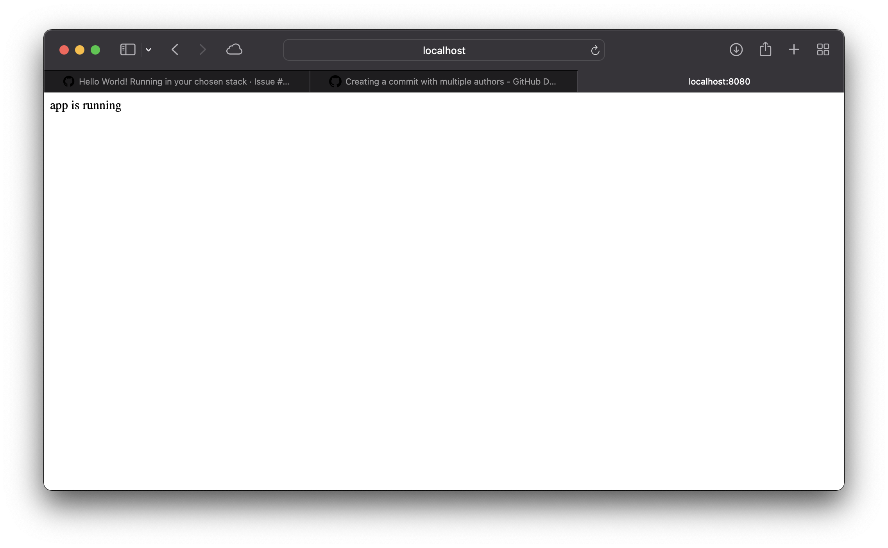

# 1. AI Workflow Integration

---

- [1. AI Workflow Integration](#1-ai-workflow-integration)
  - [1.1. Project Brief](#11-project-brief)
  - [1.2. User Stories](#12-user-stories)
    - [1.2.1. End user 1: John McNamara](#121-end-user-1-john-mcnamara)
    - [1.2.2. End user 2: IBM Marketing Team](#122-end-user-2-ibm-marketing-team)
    - [1.2.3. End user 3: IBM Software Developers](#123-end-user-3-ibm-software-developers)
  - [1.3. Deployment Instructions](#13-deployment-instructions)
    - [1.3.1. Requirements](#131-requirements)
    - [1.3.2. Deployment](#132-deployment)

---

##  1.1. Project Brief

"Create a tool which will allow a user to connect a defined set of 3rd party applications and execute actions when conditions have been met e.g. when a tweet containing 'ibm' is detected place content of tweet onto a Google sheet and use Watson tone analyser to determine of tweet was positive or negative on tone. If a positive tweet then place content of tweet onto Google slide."

---

## 1.2. User Stories

In this section we document the 3 main users of such an application.

### 1.2.1. End user 1: John McNamara

As an individual in IBM, John wants to find out what people are saying about the company on Twitter and present his findings. He would like a tool where he can configure actions on a website, where he asks the website to go on Twitter and grab tweets relating to IBM and sends it to the Tone analyser and sort them into different slides. For example, when an IBM customer posts a tweet compaining that the IBM Cloud does not work well sometimes, the application automatically recoginze its tone and put it into the pile of slides where the user is sad.

### 1.2.2. End user 2: IBM Marketing Team

As a part of the IBM marketing team, they'd want to analyse the success of our marketing campains and the public's opinion on IBM products so that we can increase the success of future campains and communicate with our developers over how our products can be improved.

### 1.2.3. End user 3: IBM Software Developers

As a software developer, the team would like to create a bot that replies to user Tweets. Using the application, the developer can use the data collected by the application and stored in the database to train a machine learning model and create an AI chatbot that can reply to tweets, e.g. if a user praised an IBM service, the developer’s bot will be able to reply to the user saying thank you.

---

## 1.3. Deployment Instructions

### 1.3.1. Requirements

If you are developing this project, you will need to install the following: 

- Node.js [link][1]
- Python 3.8 or above [link][2]
- Docker [link][3]
- Docker Compose [link][4]

Ensure that you have the dependencies installed as well once you have cloned and entered the repository:

```sh
cd client && npm install
cd ..
cd server && pip3 install -r requirements.txt
cd ..
```

If you simply want to run the application, you can just download Docker Desktop and/or Docker + Docker Compose.

### 1.3.2. Deployment 

Simply run `./make_compose.sh` in a bash shell and go to http://localost:8080, the application should run.



The script creates a Compose network that has two containers -- frontend and backend. The `frontend` container is a Node.js express website that will use IBM's NODE-RED library (as requested by the client) in the future. For now it simply requests the backend for a message and displays it. (the message should read `app is running` at this time)

The `backend` container is a python [FastAPI][5] REST application that will be used to interact with a database and act as a portal to other services e.g. the tone analyser and other 3rd party APIs.

---

[1]:https://nodejs.org/en/
[2]:https://www.python.org
[3]:https://docs.docker.com/get-docker/
[4]:https://docs.docker.com/compose/install/
[5]:https://fastapi.tiangolo.com
