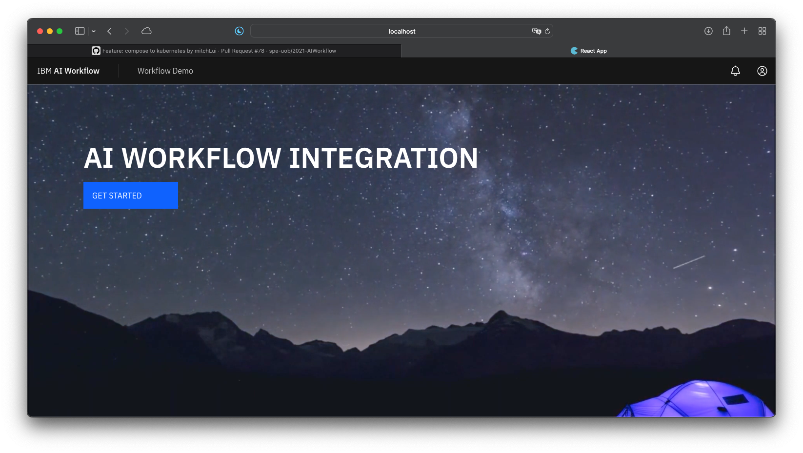

# 1. AI Workflow Integration


URL: 

> https://ai-workflow.classroom-eu-gb-1-bx2-4x1-d4ceb080620f0ec34cd169ad110144ef-0000.eu-gb.containers.appdomain.cloud/profile




---

- [1. AI Workflow Integration](#1-ai-workflow-integration)
  - [1.1. Project Brief](#11-project-brief)
  - [1.2. User Stories](#12-user-stories)
    - [1.2.1. End user 1: John McNamara](#121-end-user-1-john-mcnamara)
    - [1.2.2. End user 2: IBM Marketing Team](#122-end-user-2-ibm-marketing-team)
    - [1.2.3. End user 3: IBM Software Developers](#123-end-user-3-ibm-software-developers)
  - [1.3. Tech Stack](#13-tech-stack)
    - [1.3.1. 1.3.1 Prerequisites](#131-131-prerequisites)
    - [1.3.2. 1.3.2 Set up](#132-132-set-up)
  - [1.4. Deployment Instructions](#14-deployment-instructions)
    - [1.4.1. Requirements](#141-requirements)
    - [1.4.2. Environment and Credentials](#142-environment-and-credentials)
      - [1.4.2.1. Frontend](#1421-frontend)
      - [1.4.2.2. Backend](#1422-backend)
      - [1.4.2.3. Development](#1423-development)
      - [1.4.2.4. Deployment](#1424-deployment)
    - [1.4.3. To Deploy](#143-to-deploy)
      - [1.4.3.1. With Docker Compose](#1431-with-docker-compose)
    - [1.4.4. Continuous Integration](#144-continuous-integration)
    - [1.4.5. Continuous Delivery](#145-continuous-delivery)
  - [1.5. Wikis and Poster](#15-wikis-and-poster)
    - [1.5.1. Wiki Link](#151-wiki-link)
    - [1.5.2. CS in the city poster](#152-cs-in-the-city-poster)

---

##  1.1. Project Brief

"Create a tool which will allow a user to connect a defined set of 3rd party applications and execute actions when conditions have been met e.g. when a tweet containing 'ibm' is detected place content of tweet onto a Google sheet and use Watson tone analyser to determine of tweet was positive or negative on tone. If a positive tweet then place content of tweet onto Google slide."

---

## 1.2. User Stories

In this section we document the 3 main users of such an application.

### 1.2.1. End user 1: John McNamara

As an individual in IBM, John wants to find out what people are saying about the company on Twitter and present his findings. He would like a tool where he can configure actions on a website, where he asks the website to go on Twitter and grab tweets relating to IBM and sends it to the Tone analyser and sort them into different slides. For example, when an IBM customer posts a tweet compaining that the IBM Cloud does not work well sometimes, the application automatically recoginze its tone and put it into the pile of slides where the user is sad.

### 1.2.2. End user 2: IBM Marketing Team

As a part of the IBM marketing team, they'd want to analyse the success of our marketing campains and the public's opinion on IBM products so that we can increase the success of future campains and communicate with our developers over how our products can be improved.

### 1.2.3. End user 3: IBM Software Developers

As a software developer, the team would like to create a bot that replies to user Tweets. Using the application, the developer can use the data collected by the application and stored in the database to train a machine learning model and create an AI chatbot that can reply to tweets, e.g. if a user praised an IBM service, the developer's bot will be able to reply to the user saying thank you.

---

## 1.3. Tech Stack

### 1.3.1. 1.3.1 Prerequisites

The following tech stack was used to build the application:

- Frontend: React, using [IBM's Carbon Design System][7]
- Backend: Python, using [FastAPI][8]
- Database: [mongoDB][11]

### 1.3.2. 1.3.2 Set up

 Firstly make sure you have installed all the prerequisites.

 And then clone the repository: `git clone git@github.com:spe-uob/2021-AIWorkflow.git`

---

## 1.4. Deployment Instructions

### 1.4.1. Requirements

### 1.4.2. Environment and Credentials

#### 1.4.2.1. Frontend

The `const CLIENT_ID`  in `client/src/settings.js` has to be changed to your own OAuth Client ID, which you can learn more about [Google's Cloud Console][link]. 

The return value for `function API_DOMAIN()` must also be changed to your desired host for the backend. The default one is for testing only and is not available to anyone to use except those maintainning the repository.

#### 1.4.2.2. Backend

A `.env` file is needed. A `.env.sample` file can be found in `server/`, it should look like this:

```txt
TWITTER_BEARER_TOKEN=""
IBM_TONE_ANALZER_KEY=""
GOOGLE_SECRET=""
```

To get a twitter bearer token, go to [Twitter's Developer Portal][14] and create an app. Once you have created an app, go to the "Keys and Access Tokens" tab and click "Create my access token". Copy the "Bearer Token" and paste it into the `.env` file. 

The IBM Tone Analyser API key can be generated by going to the IBM Cloud website and activating the service.

To get a Google Secret, a `credentials.json` file is also needed in `server/routers/internal/`, you can also follow this [guide][13], rename the file and put it in the aforementioned directory. Change the value in `.web.client_secret` to null and put the value in `GOOGLE_SECRET` in the `.env` file. 

This is to ensure that the secret is not available to the public. 

#### 1.4.2.3. Development

If you are developing this project, you will need to install the following: 

- React [link][2]
- Python 3.8 or above [link][3]
- Docker [link][4]
- Docker Compose [link][5]
- kubectl [link][6]

Ensure that you have the dependencies installed as well once you have cloned and entered the repository:

```sh
cd client && npm install
cd ..
cd server && pip3 install -r requirements.txt
cd ..
```


#### 1.4.2.4. Deployment

If you simply want to run the application, you can just download Docker Desktop and/or Docker + Docker Compose.

### 1.4.3. To Deploy

The script creates a Compose network that has two containers -- frontend and backend. The `frontend` container is a React website that will use IBM's NODE-RED library (as requested by the client) in the future. 

For the Beta it displays a website that is created using React, built on [IBM's Carbon Design System][7]. The forms allows you to run a default workflow.

The `backend` container is a python [FastAPI][8] REST application that will be used to interact with a database and act as a portal to other services e.g. the tone analyser and other 3rd party APIs.

There is also a `dongo` container that is the mongoDB database used to store user data. The reason it is called dongo is due to Mitch was thinking docker and mongo together, therefore misspeaking and said the word 'dongo' instead of 'mongo'.

For documentation regarding the `frontend` and `backend`, please consult the [`docs`][9] folder.

#### 1.4.3.1. With Docker Compose

Simply run `./make_compose.sh` in a bash shell and go to http://localost:8080, the application should run.

### 1.4.4. Continuous Integration

We decided to use GitHub actions that triggers whenever we start a pull request. 

### 1.4.5. Continuous Delivery

We decided to use a GitHub action that triggers whenever we push to main. 

The repository should have two secrets:
1. ICR_NAMESPACE (The namespace of your cluster)
2. IBM_CLOUD_API_KEY (An API key to access IBM Cloud)

Detailed instructions can found in [the actual action file](/.github/workflows/ibm.yml)

**IMPORTANT**: Please run the ibm_cloud_setup.sh shell script prior to running the action.

```sh
./ibm_cloud_setup.sh <REGISTRY_HOSTNAME> <IBM_CLOUD_API_KEY> <ICR_NAMESPACE>
```

The action builds three images and containers (one for each service detailed above) and pushes it to IBM's IKS where our client can access the platform.

To test locally, use [act][10]:

```sh
act --container-architecture linux/amd64 -s IBM_CLOUD_API_KEY="xxx" -s ICR_NAMESPACE="xxx"
```

---

## 1.5. Wikis and Poster

### 1.5.1. Wiki Link

Our [Wikis][12] contains our developments progress and the achievements and goals for every release version.

### 1.5.2. CS in the city poster

Our [poster](/ai-workflow-poster.pdf) is an overview of our project, containing client userstories, problems we encountered, approaches to solve them and some screenshots about our program.

---

[2]:https://reactjs.org
[3]:https://www.python.org
[4]:https://docs.docker.com/get-docker/
[5]:https://docs.docker.com/compose/install/
[6]:https://kubernetes.io/docs/tasks/tools/
[7]:https://github.com/carbon-design-system/carbon
[8]:https://fastapi.tiangolo.com
[9]:https://github.com/spe-uob/2021-AIWorkflow/tree/main/docs
[10]:https://github.com/nektos/act
[11]:https://www.mongodb.com
[12]:https://github.com/spe-uob/2021-AIWorkflow.wiki.git
[13]:https://developers.google.com/identity/protocols/oauth2/web-server
[14]:https://developer.twitter.com/en/apps/