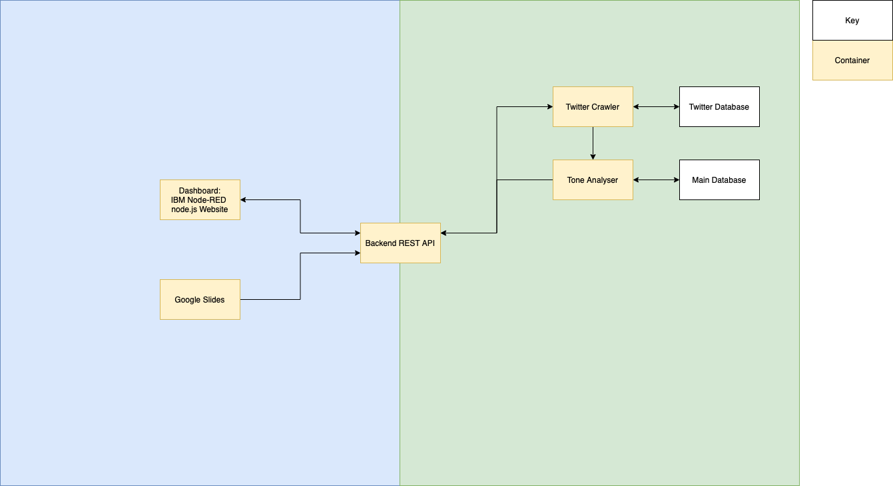

# 1. AI Workflow Integration

- [1. AI Workflow Integration](#1-ai-workflow-integration)
  - [1.1. Project Brief](#11-project-brief)
  - [1.2. User Stroies](#12-user-stroies)
  - [1.3. Platform Design](#13-platform-design)

##  1.1. Project Brief

"Create a tool which will allow a user to connect a defined set of 3rd party applications and execute actions when conditions have been met. E. G when a tweet containing ‘ibm’ is detected place content of tweet onto a Google sheet and use Watson tone analyser to determine of tweet was positive or negative on tone. If a positive tweet then place content of tweet onto Google slide."

## 1.2. User Stroies

Our first Stakeholder is our client, John McNamara. As an individual in IBM, he wants to find out what people are saying about the company on Twitter and present his findings. 
He aims to sort thse tweets by using Waston Tone Analyzer and add tweets into corresponding google slides. He would like a tool where he can configure actions on a website, where
he asks the website to go on Twitter and grab tweets relating to IBM and sends it to the Tone analyser and sort them into different slides.
For example, when an IBM customer posts a tweet compaining that the IBM Cloud does not work well sometimes, the application automatically recoginze its tone and put it into the pile of slides where the user is sad.

Marketing user story: As a part of the IBM marketing team, I want to analyse the success of our marketing campains and the public's opinion on IBM products so that we can increase the success of future campains and communicate with our developers over how our products can be improved.

As a software developer, the team would like to create a bot that replies to user Tweets. Using the application, the developer can use the data collected by the application and stored in the database to train a machine learning model and create an AI chatbot that can reply to tweets, e.g. if a user praised an IBM service, the developer’s bot will be able to reply to the user saying thank you.

## 1.3. Platform Design

The above diagram shows the design of the platform. 

The project will be built using the following technologies:

1. node.js + [IBM Node-RED][1] (Front-end)
2. Python (Back-end)
3. Docker (Containerise services)

The containers will be orchested using [Kubernetes][2] and deployed on [IBM Cloud][3]. 

---
[1]:https://developer.ibm.com/components/node-red/
[2]:https://kubernetes.io
[3]:https://www.ibm.com/uk-en/cloud